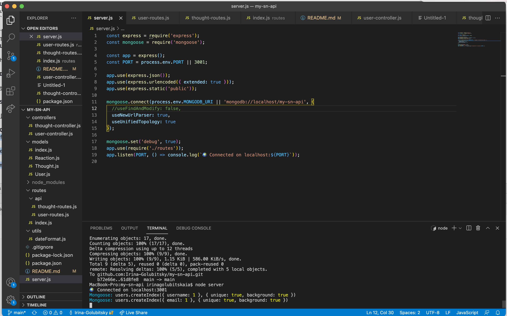

# my-sn-api [](https://opensource.org/licenses/MIT)
​
An API for a social network web application
​
## Technologies Used

* Express.js (routing)
* MongoDB (database)
* Mongoose ODM

## Description 

 This is an API for social network that uses a NoSQL database, wich can handle large amounts of unstructured data. You can invoke the application in command line and test all of the routes in Insomnia Core.


```
WHEN I open API GET routes in Insomnia Core for users and thoughts
THEN the data for each of these routes is displayed in a formatted JSON
WHEN I test API POST, PUT, and DELETE routes in Insomnia Core
THEN I am able to successfully create, update, and delete users and thoughts in my database
WHEN I test API POST and DELETE routes in Insomnia Core
THEN I am able to successfully create and delete reactions to thoughts and add and remove friends to a user’s friend list
```
## Table of Contents 
- [Installation](#installation)
- [License](#license)
- [Demo](#demo)
- [ScreenShot](#screenshot)
- [Questoins](#questions)

## Installation
Run the following command in a terminal at the root of this project
``` 
npm i
npm run start /or/ node server.js
```
Test your routes in Insomnia Core


## License 
  
  The MIT License

## Demo

This video shows some of the api routes (not all of them):
  
 https://watch.screencastify.com/v/JTnEhBpwrjEWQZMhiBMr

## ScreenShot
  
   |  
   
## Questions
If you hane any questions:
  
  Get in touch with me on Github [Irina-Golubitsky](https://github.com/Irina-Golubitsky)
  
  Email me irina.golubitsky@gmail.com
